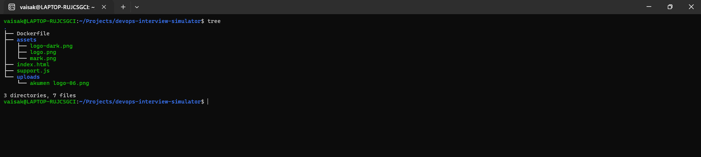
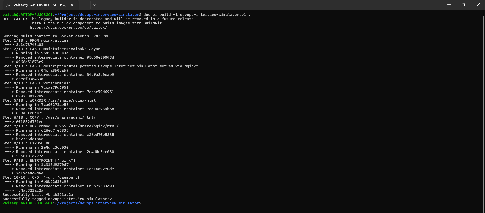
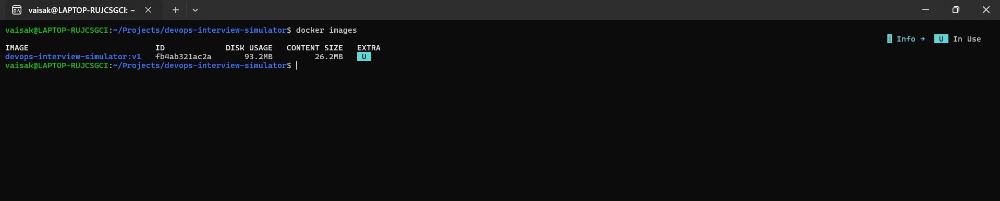
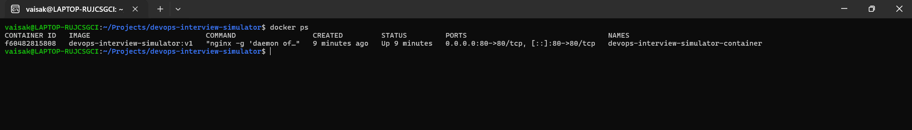
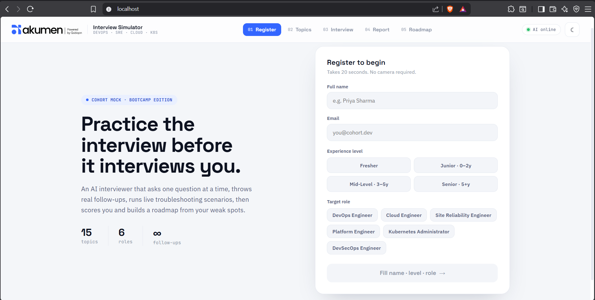

# DevOps Interview Simulator

A static web application running inside a Docker container using Nginx.

---

## Tech Stack

<p>
  
  
  
  
  
</p>

---

## Project Structure

Command:

```bash
tree
```

```text
.
├── Dockerfile
├── README.md
├── assets
│   ├── logo-dark.png
│   ├── logo.png
│   └── mark.png
├── index.html
├── support.js
├── uploads
│   └── akumen logo-06.png
└── screenshots
    ├── 01-project-structure.png
    ├── 02-docker-build-success.png
    ├── 03-docker-images.png
    ├── 04-running-container.png
    └── 05-website-output.png
```



---

## Dockerfile

```dockerfile
FROM nginx:alpine

COPY index.html /usr/share/nginx/html/index.html
COPY support.js /usr/share/nginx/html/support.js
COPY assets /usr/share/nginx/html/assets
COPY uploads /usr/share/nginx/html/uploads

EXPOSE 80

CMD ["nginx", "-g", "daemon off;"]
```

---

## Build Docker Image

Command:

```bash
docker build -t devops-interview-simulator:v1 .
```



---

## Check Docker Image

Command:

```bash
docker images
```



---

## Run Docker Container

Command:

```bash
docker run -d --name devops-interview-simulator-container -p 80:80 devops-interview-simulator:v1
```

Port mapping:

```text
80:80
```

Meaning:

```text
Host port 80 → Container port 80
```

---

## Check Running Container

Command:

```bash
docker ps
```



---

## Open Application

Open in browser:

```text
http://localhost
```



---

## Stop Container

Command:

```bash
docker stop devops-interview-simulator-container
```

---

## Remove Container

Command:

```bash
docker rm -f devops-interview-simulator-container
```

---

## Author

**Vaisakh Jayan**

- GitHub: [jayvaisakh](https://github.com/jayvaisakh)
- LinkedIn: [jayvaisakh](https://www.linkedin.com/in/jayvaisakh/)
- Medium: [@jaynvaisak](https://medium.com/@jaynvaisak)

